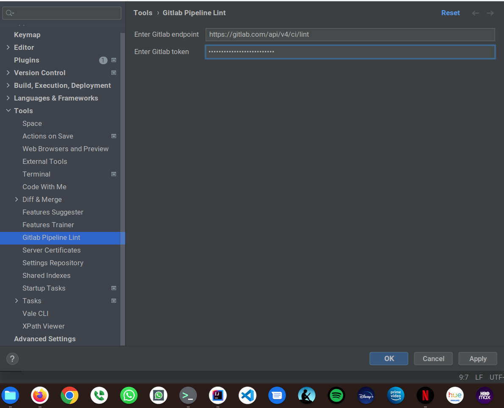
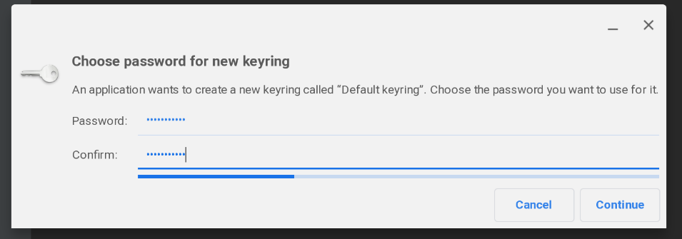

= Gitlab Pipeline Lint Plugin
:icons: font

image:https://gitlab.com/pablomxnl/gitlab-yaml-pipeline-lint/-/badges/release.svg[link="https://gitlab.com/pablomxnl/gitlab-yaml-pipeline-lint/-/releases",title="Latest Release"]
image:https://img.shields.io/jetbrains/plugin/d/org.ideplugins.gitlab-yaml-pipeline-lint[link="https://plugins.jetbrains.com/plugin/19972-gitlab-pipeline-lint",title="Downloads"]
image:https://img.shields.io/gitlab/issues/open/pablomxnl/gitlab-yaml-pipeline-lint?style=plastic[link="https://gitlab.com/pablomxnl/gitlab-yaml-pipeline-lint/-/issues", title="GitLab issues"]
image:https://img.shields.io/jetbrains/plugin/r/stars/org.ideplugins.gitlab-yaml-pipeline-lint[link="https://plugins.jetbrains.com/plugin/19972-gitlab-pipeline-lint/reviews",title="Ratings"]
image:https://img.shields.io/jetbrains/plugin/v/org.ideplugins.gitlab-yaml-pipeline-lint[link="https://plugins.jetbrains.com/plugin/19972-gitlab-pipeline-lint",title="Version"]
image:https://gitlab.com/pablomxnl/gitlab-yaml-pipeline-lint/badges/main/coverage.svg[link="https://gitlab.com/pablomxnl/gitlab-yaml-pipeline-lint/-/commits/main",title="Coverage report"]

Plugin for JetBrains IDE's that uses https://docs.gitlab.com/ee/api/lint.html[Gitlab CI Lint API] to validate the content of your `gitlab-ci.yml` file

TIP: This is a pet project. Not associated with Gitlab or JetBrains whatsoever

== Installation

=== From plugin marketplace

`Settings` (or `Preferences` if using mac) -> `Plugins` -> `Marketplace` Search for `Gitlab Pipeline Lint` -> Click `Install`

=== From gitlab releases
To install, grab a zip file from the
https://gitlab.com/pablomxnl/gitlab-yaml-pipeline-lint/-/releases[releases distributions] according to your IDE

`Settings` (or `Preferences` if using mac) -> `Plugins` -> `⚙` -> `Install Plugin from Disk...`

== Configuration

The plugin requires a Gitlab token and a project ID in order to invoke the Gitlab Lint API.

To enter this configuration go to
`Settings` (or `Preferences` if using mac) -> `Tools` -> `Gitlab Pipeline Lint`

Depending on your Operating System you may get a dialog to store the gitlab token encrypted  on a KeePass format (windows), a keychain (macOS) or libsecret (linux).

== Uninstall

. Go to `Settings` => `Plugins` => `Installed`
. Click `Gitlab Pipeline Lint` entry and click the gear `⚙` icon. Older Intellij versions had a `Disabled` dropdown
. Select `Uninstall`

